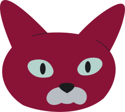

# HolaKittens

Este repositorio es el resultado de la prueba técnica escrita por
**_Maurizio Kraus_** aspirando a la posicion de desarrollador front end
con React.js para la empresa HolaFly.

### Observaciones clave

- Existe una version de la aplicación desplegada y accesible a través
  de este [link](https://holakittens-ffa74.firebaseapp.com/)
  Este enlace dirige a una versión que sólo contiene la porción del
  cliente de la aplicación, adicionalmente esta aplicación fue desplegada
  en el servicio de Baas Google Firebase.

- El diseño creado como base para la aplicación puede ser explorado en
  el siguente [link](https://www.figma.com/file/5VcSWbnw8UKWAV0XTkfA0J/HolaKittens?node-id=0%3A1&t=0c4UqN7e3DJxNSRE-1)

- Como se puede observar al comparar la versión desplegada y el diseño
  hay interacciones y elementos que pueden ser mejorados o pulidos
  especialmente en términos de animación y responsividad, no es de extrañar
  que uno de los principios del buen código es el continuo mejoramiento.

- El entorno de testeo fue correctamente configurado, en un futuro sprint
  podría darse prioridad a la creación de tests unitarios y tests de integración
  ya que una buena parte del exito del proceso de testeo se basa en la
  reutilización de herramientas creadas para tal fin que agilizan el ciclo
  propuesto en el paradigma TDD

- La imagen de Docker que contiene el backend excedía el tamaño máximo
  permitido por gitHub, aún así el producto de la compilación del dockerfile
  fue probado exitosamente en el entorno local.

- El puerto expuesto para el backend es el **5522**

- El comando para iniciar el front end en el entorno local es 'npm run dev'

- El comando para inicial el back end es 'npm start'
